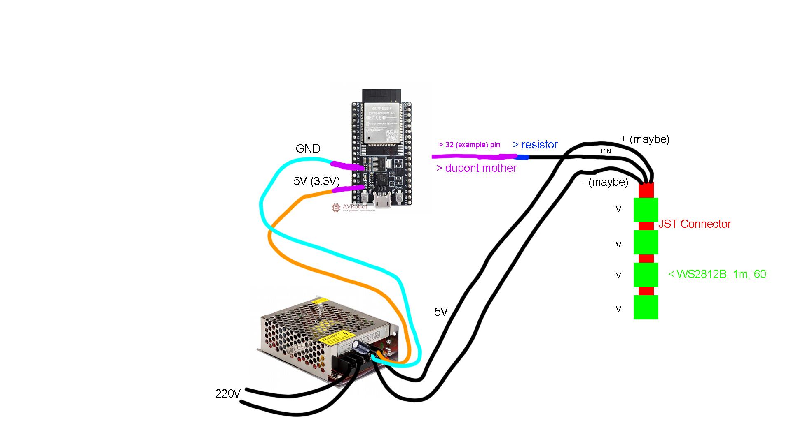

# ledy-micro

Прошивка для контроллеров серии ESP32. Установив её на контроллер можно управлять светодиодной лентой WS2812B, например с компьютера или смартфона.

## Инструкция



Я опишу свой сетап. Лента на 240 светодиодов, вклеенных в алюминиевые профили, ленты соединены через коннекторы.

**Я не несу ответственности за ссылки. Они для примера.**

### Покупка деталей

- [WS2812B DC5V, 5m, 60](https://aliexpress.ru/item/1005004289391906.html?sku_id=12000028647033757).
    - 5 метров, 60 светодиодов на метр. У нас будет 4 метра, итого 240 светодиодов.

- [Блок для питания светодиодных лент 5V, 20A](https://aliexpress.ru/item/32983648084.html?sku_id=12000020572027891).
    - Подходит для 250 светодиодов. Если у вас больше светодиодов, лента будет не такой яркой. Более мощные блоки имеют шумный вентилятор.

- [ESP32-WROOM-32D](https://aliexpress.ru/item/32802431728.html?sku_id=12000016105015423&spm=a2g2w.productlist.search_results.0.31b129bcwI0NCZ).
    - Будет управлять лентой, а им будем управлять через Wi-Fi. Прошивка проверялась на нём. Другие версии ESP тоже могут подойти, но я не проверял.

- [Трёхпиновый JST мама-папа (25 мам и 25 пап)](https://aliexpress.ru/item/32801353259.html?sku_id=64124731349).
    - Будут использоваться для соединения лент между собой.

- [Набор перемычек Dupont](https://aliexpress.ru/item/4000203371860.html?sku_id=10000000774493025).
    - Хватит набора мама-мама; мама-папа; папа-папа. В общем 120 штук. На запас.

- [Конденсатор 1000uF 35V](https://aliexpress.ru/item/32979694071.html?sku_id=66743790762&spm=.search_results.0.31473ff56FQOPi).
    - Чтобы всё работало стабильно. Наверное.

- [Резистор от 330 до 500 ohm](https://aliexpress.ru/item/32799429233.html?sku_id=64117250878&spm=a2g2w.productlist.search_results.0.414d22d02NhVjr).
    - Чтобы с контроллера на ленту данные поступали без проблем.

- [4 метровых алюминиевых профиля для светодиодной ленты](https://aliexpress.ru/item/1005005236328671.html?sku_id=12000032314503343&spm=.search_results.7.2ffc3447KrAG6H).
    - Плюсы: лента защищена, свет рассеивается, красиво.
    - Минусы: дорого.

- Провод, чтобы выдерживал 200V.
    - Например можно срезать со светильника.

- Несколько метров проводов для ленты.
    - Количество метров зависит от того, как далеко лента будет от блока питания. Слишком длинный провод не подойдет: питание будет падать, сигнал будет доходить намного дольше.
    - Подойдет даже витая пара, если смотать в один провод. Говорят чем больше сечение, тем меньше будет потерь питания. Но провода с большим сечением дорогие и неудобные. В общем берите в меру толстый провод. Я использую витую пару из 6 жил или типа того.

## Установка прошивки

- [Скачайте и установите USB драйвер для чипов CP210x](https://www.silabs.com/developers/usb-to-uart-bridge-vcp-drivers?tab=downloads).

- [Установите ESP-IDF для VS Code](https://github.com/espressif/vscode-esp-idf-extension/blob/master/docs/tutorial/install.md).
    - Возможно это самая сложная вещь в этой инструкции. Детали установки долго расписывать. Не стесняйтесь гуглить и задавать вопросы.

- Скачайте или клонируйте этот репозиторий (проект) в котором вы сейчас читаете эту инструкцию.

- Откройте этот проект в VS Code. Подождите пока ESP-IDF скачивает зависимости, и всё настраивает.

- Нажмите ``F1``, введите ``sdk conf``, в меню выберите ``SDK Configuration editor (Menuconfig)``.

- В поиске введите ``ledy``, введите в поля ``WiFi SSID`` и ``WiFi Password`` имя и пароль вашей Wi-Fi сети.

- В поиске введите ``websocket`` и включите галочку ``WebSocket server support``.

- Нажмите кнопку ``Save``.

- Нажмите ``F1``, введите ``Build, Flash and Start a Monitor on your Device``, и запустите. Возможно появится окно выбора порта к которому подключен ESP32, и так далее. В итоге внизу появится терминал, в котором будет видно процесс установки прошивки. Когда начнут появлятся разные зеленые надписи, или что-то будет написано про Wi-Fi, значит прошивка установилась.

## Клиент

Запустите всю схему, скачайте или разработайте свой клиент. Дальнейшие инструкции зависят от программ-клиентов.

Мои клиенты:

- [Android](https://github.com/oklookat/ledy-a)

- [Go](https://github.com/oklookat/ledy)

- [C++](https://github.com/oklookat/ledy-c)

## Для разработчиков

Для соединения с лентой запустите в вашем клиенте DNS-SD Discovery, ищите сервис _ledy._tcp.local. После нахождения IP подключайтесь к нему по WebSocket, к порту 80, по пути /ws.

Протокол данных (BINARY):

```[1 BYTE COMMAND (0-255)] [2 BYTES DATA LEN] [??? DATA]```

На данный момент доступа только команда для установки светодиодов:

```[0] [2 BYTES LED DATA LEN] [??? BYTES LED DATA; G, R, B]```